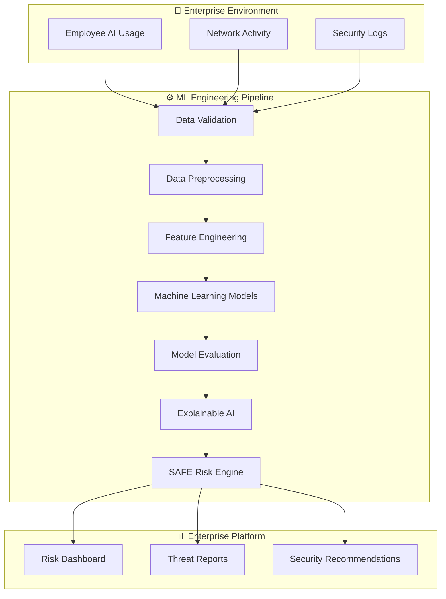

<p align="center">
  
</p>

<div align="center">

# 🛡️ SAFE

### Secure AI For Enterprise

### Enterprise AI Governance Platform for Shadow AI Detection & Explainable Risk Intelligence

<p>


</p>

*"Building intelligent AI governance through modern Machine Learning Engineering."*

</div>

---

# 📖 Overview

SAFE (**Secure AI For Enterprise**) is an enterprise-grade Machine Learning platform designed to detect, analyze, and explain risks associated with **Shadow AI**—the unauthorized or unmanaged use of Artificial Intelligence tools inside organizations.

The platform analyzes behavioral patterns and security-related events to identify risky AI usage, estimate enterprise risk, and generate explainable insights for security teams.

SAFE follows the complete Machine Learning Engineering lifecycle including:

- Data Engineering
- Data Validation
- Feature Engineering
- Machine Learning
- Explainable AI
- Risk Scoring
- Dashboard Development
- Software Engineering Best Practices

---

# 🚨 The Problem

The rapid adoption of Generative AI has introduced a new cybersecurity challenge.

Organizations often have limited visibility into how employees interact with external AI services.

This creates risks such as:

- 🔐 Confidential Data Leakage
- 💻 Source Code Exposure
- 📄 Internal Document Sharing
- 💳 Financial Information Disclosure
- 👤 Customer Data Exposure
- ⚠️ Compliance Violations

SAFE provides an intelligent Machine Learning solution that detects risky AI behavior before it becomes a security incident.

---

# ✨ Core Capabilities

- 🛡️ Shadow AI Detection
- 📊 Behavioral Analytics
- 🧠 Machine Learning Risk Prediction
- 🔍 Explainable AI
- 📈 Enterprise Risk Scoring
- 📉 Multi-Model Evaluation
- ⚙️ Modular ML Pipeline
- 📋 Interactive Dashboard

---

# 🏗️ SAFE System Architecture



---

# 🚀 Development Roadmap

## Phase 1 — Foundation

- [x] Repository Setup
- [x] Documentation
- [x] Project Planning

---

## Phase 2 — Data Engineering

- [ ] Dataset Design
- [ ] Data Collection
- [ ] Data Validation
- [ ] Data Cleaning
- [ ] Exploratory Data Analysis

---

## Phase 3 — Machine Learning

- [ ] Feature Engineering
- [ ] Logistic Regression
- [ ] Decision Tree
- [ ] Random Forest
- [ ] XGBoost
- [ ] Model Comparison
- [ ] Hyperparameter Optimization

---

## Phase 4 — Explainability

- [ ] SHAP
- [ ] Feature Importance
- [ ] Explainable Risk Analysis

---

## Phase 5 — Enterprise Platform

- [ ] SAFE Risk Engine
- [ ] Interactive Dashboard
- [ ] Testing
- [ ] Documentation

---

# 🛠️ Technology Stack

| Layer | Technologies |
| :--- | :--- |
| Programming | Python |
| Data Processing | Pandas, NumPy |
| Machine Learning | Scikit-learn, XGBoost |
| Visualization | Matplotlib |
| Explainability | SHAP |
| Dashboard | Streamlit |
| Version Control | Git, GitHub |

---

# 📂 Repository Structure

```text
SAFE/
│
├── docs/
├── datasets/
│   ├── raw/
│   └── processed/
├── src/
├── tests/
│
├── README.md
├── requirements.txt
└── .gitignore
```

---

# 🌍 Future Enhancements

- ⚡ Real-Time Monitoring
- 🌐 REST API
- 📊 Advanced Analytics Dashboard
- ☁️ Cloud Deployment
- 🔄 Continuous Model Monitoring
- ⚙️ MLOps Pipeline

---

# 📌 Project Status

SAFE is currently under active development.

The project is being built incrementally following modern Machine Learning Engineering principles with a strong focus on scalability, reproducibility, maintainability, and clean software architecture.

---

<div align="center">

### ⭐ If you like this project, consider giving it a star.

</div>
