<div align="center">

# 🛡️ SAFE

### Secure AI For Enterprise

### Enterprise AI Governance Platform for Shadow AI Detection & Explainable Risk Intelligence


*"Building the next generation of enterprise AI governance through Machine Learning."*

</div>

---

# 📖 Overview

SAFE (**Secure AI For Enterprise**) is an enterprise-grade Machine Learning platform designed to detect, assess, and explain risks associated with **Shadow AI**—the unauthorized or unmanaged use of Artificial Intelligence tools within organizations.

As enterprises rapidly adopt Generative AI solutions, employees increasingly interact with external AI systems, creating new security, privacy, and compliance challenges.

SAFE analyzes behavioral and security-related data to identify risky AI usage patterns, estimate organizational risk, and generate explainable insights that enable security teams to make informed decisions.

Unlike traditional academic Machine Learning projects that focus solely on model accuracy, SAFE is built using modern **Machine Learning Engineering** principles with an emphasis on clean architecture, reproducibility, modularity, explainability, scalability, and maintainability.

---

# 🚨 Problem Statement

Organizations often have limited visibility into how employees use external AI tools.

Employees may unintentionally expose confidential information, proprietary source code, financial records, customer information, or internal business documents while interacting with AI assistants.

Without an intelligent governance system, these activities introduce security vulnerabilities, regulatory compliance risks, and potential insider threats.

SAFE addresses this challenge by applying Machine Learning techniques to detect risky AI behavior, assess enterprise risk, and provide explainable security intelligence.

---

# ✨ Key Features

- 🛡️ Shadow AI Risk Detection
- 📊 Behavioral Analytics
- 🧠 Machine Learning-Based Risk Prediction
- 🔍 Explainable AI
- 📈 Enterprise Risk Scoring
- 📉 Model Performance Evaluation
- ⚙️ Modular ML Pipeline
- 📋 Interactive Risk Dashboard
- 🧪 Production-Oriented ML Engineering

---

# 🏗️ Machine Learning Pipeline

```mermaid
flowchart LR

A["🏢 Business Problem"] --> B["📥 Data Collection"]

B --> C["✅ Data Validation"]

C --> D["🧹 Data Preprocessing"]

D --> E["📊 Exploratory Data Analysis"]

E --> F["🧠 Feature Engineering"]

F --> G["🤖 Machine Learning Models"]

G --> H["📈 Model Evaluation"]

H --> I["🔍 Explainable AI"]

I --> J["🛡️ SAFE Risk Engine"]

J --> K["📊 Dashboard"]
```



---

# 🚀 Development Roadmap

## Phase 1 — Foundation

- [x] Repository Setup
- [x] Documentation
- [x] Project Planning

## Phase 2 — Data Engineering

- [ ] Dataset Design
- [ ] Data Ingestion
- [ ] Data Validation
- [ ] Data Cleaning
- [ ] Exploratory Data Analysis

## Phase 3 — Machine Learning

- [ ] Feature Engineering
- [ ] Baseline Models
- [ ] Model Comparison
- [ ] Hyperparameter Optimization
- [ ] Model Evaluation

## Phase 4 — Explainability

- [ ] Feature Importance
- [ ] Explainable AI
- [ ] Risk Interpretation

## Phase 5 — Enterprise Platform

- [ ] SAFE Risk Engine
- [ ] Interactive Dashboard
- [ ] Testing
- [ ] Documentation

---

# 🛠️ Technology Stack

| Category | Technologies |
|-----------|--------------|
| Programming | Python |
| Data Processing | Pandas, NumPy |
| Machine Learning | Scikit-learn, XGBoost |
| Visualization | Matplotlib |
| Explainability | SHAP |
| Dashboard | Streamlit |
| Version Control | Git, GitHub |

---

# 📂 Project Structure

```text
SAFE/
│
├── docs/
├── datasets/
│   ├── raw/
│   └── processed/
├── src/
├── tests/
│
├── README.md
├── requirements.txt
└── .gitignore
```

---

# 🎯 Learning Objectives

This project is being developed to strengthen practical expertise in:

- Machine Learning Engineering
- Data Validation
- Data Preprocessing
- Exploratory Data Analysis
- Feature Engineering
- Model Development
- Model Evaluation
- Explainable AI
- Software Engineering for Machine Learning
- Git & GitHub Best Practices

---

# 🌍 Future Enhancements

- Real-Time Risk Monitoring
- Advanced Explainability
- Dashboard Analytics
- Enterprise Reporting
- REST API
- Cloud Deployment
- MLOps Integration

---

# 📌 Current Status

🚧 SAFE is currently under active development.

Every milestone is implemented incrementally using production-oriented Machine Learning Engineering practices with a strong emphasis on maintainability, scalability, reproducibility, and clean software architecture.

---

<div align="center">

### ⭐ If you find this project useful, consider giving it a star!

</div>
